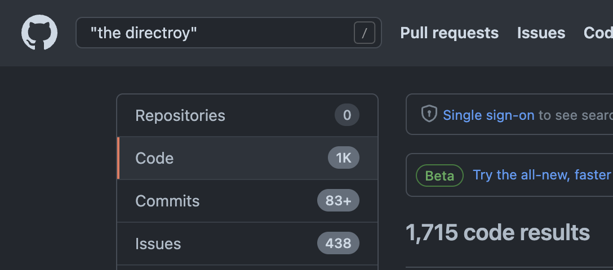

# MatrixGPT

These are some scripts to interact with [OpenAI's APIs](https://platform.openai.com/docs/api-reference). Inspired by ["become a 1000x engineer or die tryin'](https://kadekillary.work/posts/1000x-eng/). With scripts named after characters from the Matrix.

These are more for my personal use and written on macos (Specifically... for getting the token, I like using secret stores). The expectation is that there's an OpenAI API key in keychain under `OpenAI` and `$USER`. Sharing incase I ever drop my laptop.

Also requires [`jq`](https://stedolan.github.io/jq/) and [`curl`](https://curl.se/) to be installed and in the path. Also... expect you to have [`fish`](https://fishshell.com/) installed.

## Oracle

```txt
Usage: oracle [options]
  -h, --help
      Prints this help message
  -m, --message
      Sets the message to send
  -s, --system
      Sets the system prompt
  -c, --clear
      Clears the message cache
```

A wrapper around the [chat completion endpoint](https://platform.openai.com/docs/api-reference/chat) using `gpt-3.5-turbo`, keeps chat history in `$TMPDIR/oracle.cache`. The cache is used for submitting requests with the chat history (last 10 requests and replies).

Cache is in a temporary directory, the expectation is you don't really remember what you were doing when the temporary directory is cleared anyways. I kind of wanted something tied to the current shell, but I don't know how to do that... (maybe I should have asked).

```sh
oracle -m 'Write a python script that counts from 1 to 10.'
```

> Here's a simple script in Python that counts from 1 to 10 using a for loop:
>
> ```python
> for i in range(1, 11):
>    print(i)
> ```
>
> This code will output the numbers 1 through 10 in the console.

```sh
oracle -m 'How about in C?'
```

> Sure, here's a basic C program that counts from 1 to 10 using a for loop:
>
> ```c
> #include <stdio.h>
>
> int main() {
>    int i; // declare a variable to use as the counter
>
>    for (i = 1; i <= 10; i++) {
>        printf("%d\n", i); // print the current value of i
>    }
>
>    return 0; // indicate successful completion of the program
> }
> ```
>
> This program should display the numbers 1 through 10 in the console, just like the Python script

## Neo

Neo is a wrapper on the [code edits](https://platform.openai.com/docs/api-reference/edits). It can take in a file (either piped using stdin or using `-f <file>`) and an instruction `-i 'Please rewrite in python'`.

```sh
cat hello.c | neo -i 'Please rewrite in python' | tee hello.py
```

> ```python
> print("Hello, world!")
> ```

## Matrix

```txt
Usage: matrix [options]
  Prompt is read from stdin
  -h, --help
      Prints this help message
  -s, --stop
      Sets the stop sequence
```

Matrix is a wrapper on the [completion api](https://platform.openai.com/docs/api-reference/completions). It reads a prompt from standard input. Stop tokens can be specified with `-s` (multiple stop tokens can be specified by repeating the flag).

```sh
matrix
Write a python script that sorts photos based on the date taken into folders YYYY/MM using Pillow:
^D # ctrl-d to end input
```

> ```python
> import os
> import glob
> from PIL import Image
> 
> # Enter the directroy of the photos
> directory_photos = "/photos/"
> 
> # Get the list of all files and directories 
> # in given directory 
> dir_tree = os.walk(directory_photos) 
>   
> for dirpath, dirnames, filenames in dir_tree: 
>     # Loop over all the files 
>     for file_name in filenames: 
>         
>         # Get the absolute path of the file 
>         path_to_photo = os.path.abspath(os.path.join(dirpath, file_name)) 
>         
>         # Open the file using Pillow
>         photo = Image.open(path_to_photo)
> 
>         # Extract the EXIF information
>         exif_data = photo._getexif()
> 
>         # Extract the date taken
>         date_taken = exif_data[36867] 
>         
>         # extract the Year, Month
>         year, month = date_taken.split(':')[:2]
> 
>         # Create new directory name based on the date taken
>         new_directory = os.path.join(directory_photos, year, month)
> 
>         # Create directories if they don't exist
>         if not os.path.exists(new_directory):
>             os.makedirs(new_directory)
> 
>         # Move the file to the target directory
>         new_file_path = os.path.join(new_directory, file_name)
>         os.rename(path_to_photo, new_file_path)
> ```

I have not tested the output, but found "directroy" entertaining as a learned code comment.

